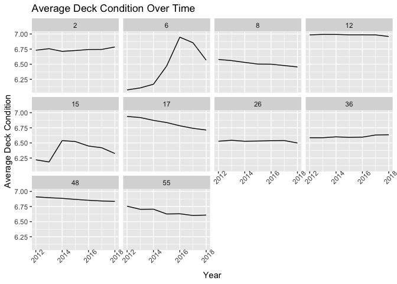

    rm(list = ls())
    library(blscrapeR)
    library(data.table)
    library(dplyr)

    ## 
    ## Attaching package: 'dplyr'

    ## The following objects are masked from 'package:data.table':
    ## 
    ##     between, first, last

    ## The following objects are masked from 'package:stats':
    ## 
    ##     filter, lag

    ## The following objects are masked from 'package:base':
    ## 
    ##     intersect, setdiff, setequal, union

    library(ggplot2)
    library(tidyverse)

    ## ── Attaching packages ────────────── tidyverse 1.3.0 ──

    ## ✓ tibble  2.1.3     ✓ purrr   0.3.3
    ## ✓ tidyr   1.0.2     ✓ stringr 1.4.0
    ## ✓ readr   1.3.1     ✓ forcats 0.4.0

    ## ── Conflicts ───────────────── tidyverse_conflicts() ──
    ## x dplyr::between()   masks data.table::between()
    ## x dplyr::filter()    masks stats::filter()
    ## x dplyr::first()     masks data.table::first()
    ## x dplyr::lag()       masks stats::lag()
    ## x dplyr::last()      masks data.table::last()
    ## x purrr::transpose() masks data.table::transpose()

Gathering Bridges data for 10 states from 2012 through 2018 totaling 70
individual data sets

    for(statee in c("WI", "AK", "CA", "CO", "FL", "HI", "IL", "MI", "NY", "TX")){
      for(yearr in 2012:2018){
        URL <- paste0("https://www.fhwa.dot.gov/bridge/nbi/",
                     yearr,
                     "/delimited/",
                     statee,
                     substr(yearr, 3,4),
                     ".txt"
                     )
        dataNames <- paste0(statee,yearr, sep = "") 
        
        assign(dataNames, fread(URL) %>% 
                 as_tibble() %>% 
                 select(STATE_CODE_001,
                        COUNTY_CODE_003,
                        ADT_029,
                        BRIDGE_IMP_COST_094, 
                        contains("COND")) %>% 
                 mutate(fips = STATE_CODE_001*1000 + COUNTY_CODE_003,
                        dataYear = yearr,
                        DECK_COND_058 = na_if(DECK_COND_058, "N"),
                        SUPERSTRUCTURE_COND_059 = na_if(SUPERSTRUCTURE_COND_059, "N"),
                        SUBSTRUCTURE_COND_060 = na_if(SUBSTRUCTURE_COND_060, "N"),
                        CHANNEL_COND_061 = na_if(CHANNEL_COND_061, "N"),
                        CULVERT_COND_062 = na_if(CULVERT_COND_062, "N"))
               #  Used https://dplyr.tidyverse.org/reference/na_if.html as reference for changing N to NA
               )
        }
    }

    # Joining all bridges files into one main file
    bridgesAll <- rbind(AK2012, AK2013, AK2014, AK2015, AK2016, AK2017, AK2018,
                CA2012, CA2013, CA2014, CA2015, CA2016, CA2017, CA2018,
                CO2012, CO2013, CO2014, CO2015, CO2016, CO2018, CO2018,
                FL2012, FL2013, FL2014, FL2015, FL2016, FL2017, FL2018,
                HI2012, HI2013, HI2014, HI2015, HI2016, HI2017, HI2018,
                IL2012, IL2013, IL2014, IL2015, IL2016, IL2017, IL2018,
                MI2012, MI2013, MI2014, MI2015, MI2016, MI2017, MI2018,
                NY2012, NY2013, NY2014, NY2015, NY2016, NY2017, NY2018,
                TX2012, TX2013, TX2014, TX2015, TX2016, TX2017, TX2018,
                WI2012, WI2013, WI2014, WI2015, WI2016, WI2017, WI2018)

Make facets over states and creat a plot with x-axis as time and y-axis
about bridge deck conditions

    avgDeckCond <- bridgesAll %>%
      group_by(STATE_CODE_001, dataYear) %>%
      summarise(count = n(),
                deck = mean(as.numeric(DECK_COND_058), na.rm = T))

    deckPlot <- ggplot(avgDeckCond, aes(x = dataYear, y = deck)) + geom_line() + facet_wrap(~STATE_CODE_001) 

    # Referenced https://ggplot2.tidyverse.org/reference/labs.html to change x and y axis labels as well as add a title
    # Referenced https://www.datanovia.com/en/blog/ggplot-axis-ticks-set-and-rotate-text-labels/ to change x axis ticks so they were not overlapping
    deckPlot + labs(title = "Average Deck Condition Over Time", x = "Year", y = "Average Deck Condition") + theme(axis.text.x = element_text(angle = 45))

Joining Bridges data to BLS data

    bls <- get_bls_county("December 2018")

    # Convert state and fips code into character in order to join properly
    bridgesAll$fips <- as.character(as.integer(bridgesAll$fips))
    bridgesAll$STATE_CODE_001 <- as.character(bridgesAll$STATE_CODE_001)

    bridgesBLS <- bridgesAll %>% 
      group_by(fips) %>% 
      summarize(count = n(), 
                deck = mean(as.numeric(DECK_COND_058), na.rm = T),
                super = mean(as.numeric(SUPERSTRUCTURE_COND_059), na.rm=T),
                sub = mean(as.numeric(SUBSTRUCTURE_COND_060), na.rm=T),
                channel = mean(as.numeric(CHANNEL_COND_061), na.rm=T),   
                culvert = mean(as.numeric(CULVERT_COND_062), na.rm=T),
                bridgeImp = mean(as.numeric(BRIDGE_IMP_COST_094), na.rm = T)) %>% 
      left_join(bls)

    ## Joining, by = "fips"

Creating a linear model to predict the number of unemployed

    lmUnemp <- lm(unemployed ~ deck + super + sub + channel + culvert + bridgeImp, data = bridgesBLS)
    summary(lmUnemp)

    ## 
    ## Call:
    ## lm(formula = unemployed ~ deck + super + sub + channel + culvert + 
    ##     bridgeImp, data = bridgesBLS)
    ## 
    ## Residuals:
    ##    Min     1Q Median     3Q    Max 
    ##  -7151  -2511  -1494   -432  92948 
    ## 
    ## Coefficients:
    ##               Estimate Std. Error t value Pr(>|t|)  
    ## (Intercept) -8.665e+03  8.299e+03  -1.044   0.2969  
    ## deck        -4.518e+03  1.777e+03  -2.543   0.0112 *
    ## super        3.384e+03  1.915e+03   1.767   0.0777 .
    ## sub          2.778e+03  1.402e+03   1.981   0.0480 *
    ## channel     -7.200e+02  9.466e+02  -0.761   0.4472  
    ## culvert      8.085e+02  8.648e+02   0.935   0.3502  
    ## bridgeImp    6.054e-02  5.397e-02   1.122   0.2625  
    ## ---
    ## Signif. codes:  0 '***' 0.001 '**' 0.01 '*' 0.05 '.' 0.1 ' ' 1
    ## 
    ## Residual standard error: 7607 on 615 degrees of freedom
    ##   (170 observations deleted due to missingness)
    ## Multiple R-squared:  0.02496,    Adjusted R-squared:  0.01545 
    ## F-statistic: 2.624 on 6 and 615 DF,  p-value: 0.01608

Creating a linear model to predict the unemployment rate

    lmUnempRate <- lm(unemployed_rate ~ deck + super + sub + channel + culvert + bridgeImp, data = bridgesBLS)
    summary(lmUnempRate)

    ## 
    ## Call:
    ## lm(formula = unemployed_rate ~ deck + super + sub + channel + 
    ##     culvert + bridgeImp, data = bridgesBLS)
    ## 
    ## Residuals:
    ##     Min      1Q  Median      3Q     Max 
    ## -2.7956 -1.0569 -0.3471  0.6907 14.1211 
    ## 
    ## Coefficients:
    ##               Estimate Std. Error t value Pr(>|t|)    
    ## (Intercept)  4.515e+00  1.728e+00   2.613   0.0092 ** 
    ## deck        -5.564e-01  3.700e-01  -1.504   0.1331    
    ## super       -5.149e-01  3.988e-01  -1.291   0.1971    
    ## sub          1.452e+00  2.919e-01   4.975 8.47e-07 ***
    ## channel     -4.509e-01  1.971e-01  -2.287   0.0225 *  
    ## culvert      4.683e-02  1.801e-01   0.260   0.7949    
    ## bridgeImp    9.785e-06  1.124e-05   0.871   0.3842    
    ## ---
    ## Signif. codes:  0 '***' 0.001 '**' 0.01 '*' 0.05 '.' 0.1 ' ' 1
    ## 
    ## Residual standard error: 1.584 on 615 degrees of freedom
    ##   (170 observations deleted due to missingness)
    ## Multiple R-squared:  0.04294,    Adjusted R-squared:  0.0336 
    ## F-statistic: 4.599 on 6 and 615 DF,  p-value: 0.0001399

Creating a linear model to predict enemployed number and rate from the
previous month

    novbls <- get_bls_county("November 2018")
    novbridgesBLS <- bridgesAll %>% 
      group_by(fips) %>% 
      summarize(count = n(), 
                deck = mean(as.numeric(DECK_COND_058), na.rm = T),
                super = mean(as.numeric(SUPERSTRUCTURE_COND_059), na.rm=T),
                sub = mean(as.numeric(SUBSTRUCTURE_COND_060), na.rm=T),
                channel = mean(as.numeric(CHANNEL_COND_061), na.rm=T),   
                culvert = mean(as.numeric(CULVERT_COND_062), na.rm=T),
                bridgeImp = mean(as.numeric(BRIDGE_IMP_COST_094), na.rm = T)) %>% 
      left_join(novbls)

    ## Joining, by = "fips"

    novlmUnempRate <- lm(unemployed_rate ~ deck + super + sub + channel + culvert + bridgeImp, data = novbridgesBLS)
    summary(novlmUnempRate)

    ## 
    ## Call:
    ## lm(formula = unemployed_rate ~ deck + super + sub + channel + 
    ##     culvert + bridgeImp, data = novbridgesBLS)
    ## 
    ## Residuals:
    ##     Min      1Q  Median      3Q     Max 
    ## -2.3455 -0.7846 -0.2434  0.5724  6.2612 
    ## 
    ## Coefficients:
    ##               Estimate Std. Error t value Pr(>|t|)    
    ## (Intercept)  2.706e+00  1.287e+00   2.103   0.0359 *  
    ## deck         1.677e-01  2.756e-01   0.609   0.5431    
    ## super       -4.483e-01  2.970e-01  -1.509   0.1317    
    ## sub          9.132e-01  2.174e-01   4.200 3.06e-05 ***
    ## channel     -5.785e-01  1.468e-01  -3.941 9.05e-05 ***
    ## culvert      1.132e-01  1.341e-01   0.844   0.3989    
    ## bridgeImp    8.539e-07  8.370e-06   0.102   0.9188    
    ## ---
    ## Signif. codes:  0 '***' 0.001 '**' 0.01 '*' 0.05 '.' 0.1 ' ' 1
    ## 
    ## Residual standard error: 1.18 on 615 degrees of freedom
    ##   (170 observations deleted due to missingness)
    ## Multiple R-squared:  0.04512,    Adjusted R-squared:  0.0358 
    ## F-statistic: 4.843 on 6 and 615 DF,  p-value: 7.615e-05

Summary: The linear model predicting the unemployment rate is better
than the model predicting the number of unemployed. We observe that the
multiple R-sqared and adjusted R-sqared values of the unemployment rate
model are about twice as large as the values for the number of
unemployed. The summary of the models shows that the bridges data gives
some information about the number of unemployed and the unemployment
rate, but the model could definetly be improved.

In this homework assignment I struggled most with joining the Bridges
and BLS data. Initally when I joined the two datasets, only 3
observations had data from BLS. This was due to a problem in my inital
combination of datasets by state. After working through that issue, I
did not run into any more major problems.
